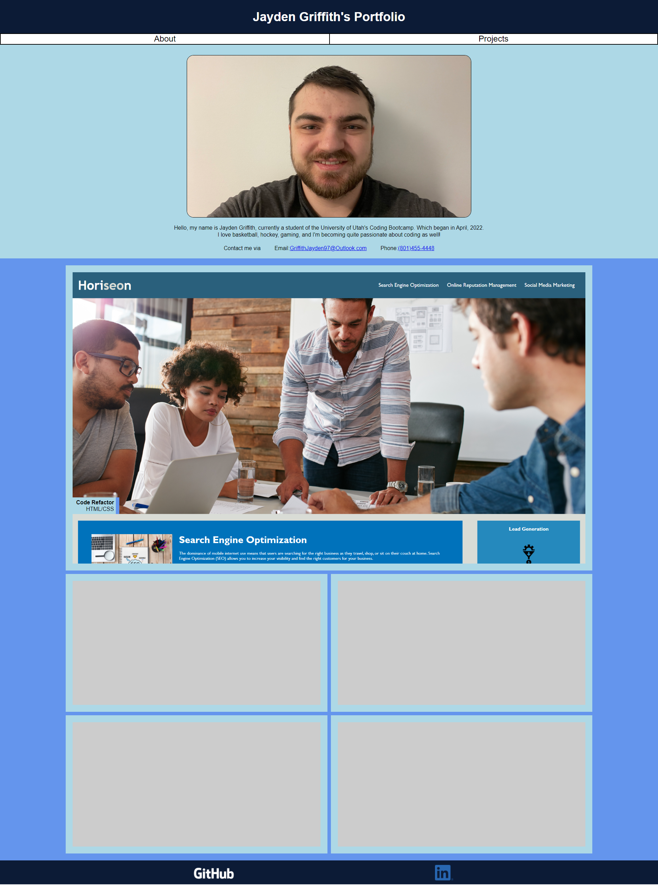

# This is a project for the UofU Coding Bootcamp's Module 2 Challenge

## The goal of this assignment was to make a responsive personal portfolio page from the ground up

Screenshot: 

Open main code file: [Portfolio](./index.html)

Live site: https://jgriffith97.github.io/Module-2-Challenge/
